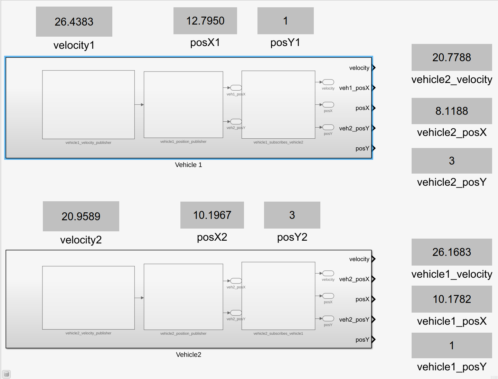
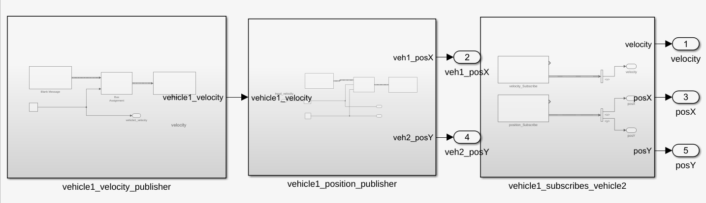
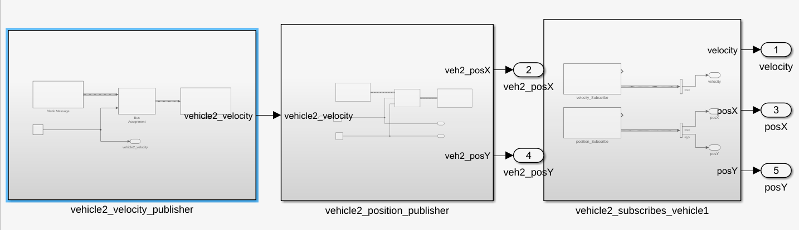

# Simulink ROS2 Two-Vehicle Publish-Subscribe Scenario

This project implements a simple two-vehicle communication scenario using MATLAB/Simulink and ROS2.

The model contains two vehicles. Each vehicle publishes its own velocity and 2D position, and subscribes to the other vehicle's velocity and position through ROS2 topics.

## Files

```text
.
├── two_vehicle_pub_sub_scenario.slx
├── README.md
├── .gitignore
└── images/
```

## Model Overview

The main Simulink model is:

```text
two_vehicle_pub_sub_scenario.slx
```

The model is organized into two main subsystems:

- `Vehicle 1`
- `Vehicle 2`

Each vehicle subsystem includes:

- velocity publisher
- position publisher
- subscriber for the other vehicle's velocity
- subscriber for the other vehicle's position

The communication between the vehicles happens through ROS2 topics.

## ROS2 Topics

| Vehicle | Publishes | Subscribes |
|---|---|---|
| Vehicle 1 | `/vehicle1/velocity` | `/vehicle2/velocity` |
| Vehicle 1 | `/vehicle1/position` | `/vehicle2/position` |
| Vehicle 2 | `/vehicle2/velocity` | `/vehicle1/velocity` |
| Vehicle 2 | `/vehicle2/position` | `/vehicle1/position` |

## Message Types

| Data | ROS2 Message Type | Fields Used |
|---|---|---|
| Velocity | `geometry_msgs/Twist` | `linear.x` |
| Position | `geometry_msgs/Point` | `x`, `y`, `z` |

The velocity is published using the `linear.x` field of the `Twist` message.  
The position is represented in 2D using the `x` and `y` fields of the `Point` message, while `z` is kept as `0`.

## Vehicle Signal Setup

Velocity is generated using sinusoidal input signals with bias values to represent realistic vehicle speeds.

| Vehicle | Velocity Bias | Velocity Amplitude | Position `y` |
|---|---:|---:|---:|
| Vehicle 1 | `25 m/s` | `3 m/s` | `1` |
| Vehicle 2 | `20 m/s` | `2 m/s` | `3` |

The `x` position is generated by integrating the vehicle velocity signal:

```text
velocity -> discrete-time integrator -> position x
```

This makes the position physically meaningful, instead of using an unrelated ramp signal.

## Main Model Screenshot

Add the main model screenshot here:

```markdown

```

## Vehicle 1 Subsystem Screenshot

Add the Vehicle 1 subsystem screenshot here:

```markdown

```

## Vehicle 2 Subsystem Screenshot

Add the Vehicle 2 subsystem screenshot here:

```markdown

```

## How to Run

Open MATLAB from a terminal where ROS2 Humble is sourced:

```bash
source /opt/ros/humble/setup.bash
export ROS_DOMAIN_ID=96
matlab
```

In MATLAB, open the Simulink model:

```matlab
open_system("two_vehicle_pub_sub_scenario")
```

Run the model from Simulink.

## Verify ROS2 Topics

In a separate terminal:

```bash
source /opt/ros/humble/setup.bash
export ROS_DOMAIN_ID=96
ros2 topic list
```

Example topic checks:

```bash
ros2 topic echo /vehicle1/velocity --once
ros2 topic echo /vehicle1/position --once
ros2 topic echo /vehicle2/velocity --once
ros2 topic echo /vehicle2/position --once
```

Expected topics include:

```text
/vehicle1/velocity
/vehicle1/position
/vehicle2/velocity
/vehicle2/position
```

## Notes

The Simulink `Display` block cannot directly display a full ROS2 message bus. A `Bus Selector` block is used to extract specific fields such as `linear.x`, `x`, and `y` before displaying them.
